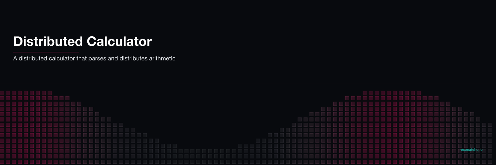

<p align="center">
  
</p>

# Resonator

Resonator is a distributed calculator that can calculate basic
arithmetic expressions that contain numbers and the following
symbols:
```
( ) + - *
```

Resonator splits an expression into tasks (sub expressions) and
distributes those tasks to workers to calculate.

Give it a try by typing an expression such as:
```
(1 + 2)
(1 + 2) * 3
(1 + 2) * (3 - 4)
```

Resonator is built with [Resonate](https://github.com/resonatehq/resonate).

# Getting started

Before you get started you will need to [install Resonate](https://github.com/resonatehq/resonate/tree/main?tab=readme-ov-file#install).

```
# start resonate server
resonate serve

# start resonator
uv sync

# start exp task group
GRP=exp PID=lhs uv run resonator
GRP=exp PID=rhs uv run resonator

# start ops task group
GRP=ops uv run resonator

# start command prompt
uv run resonator
```
